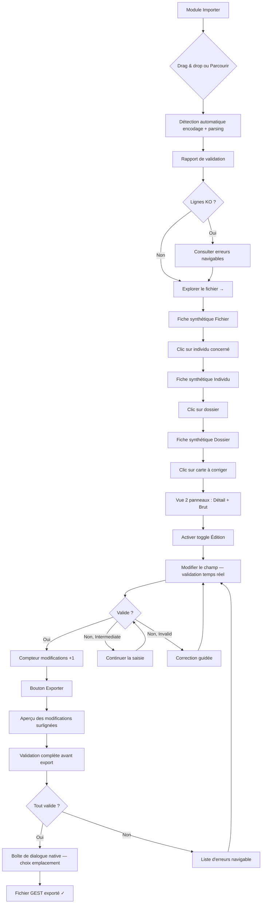
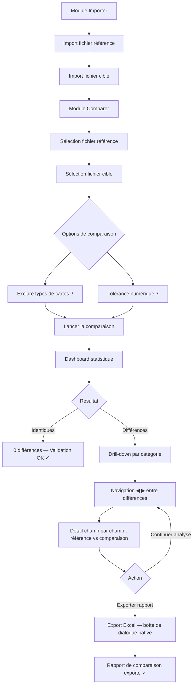
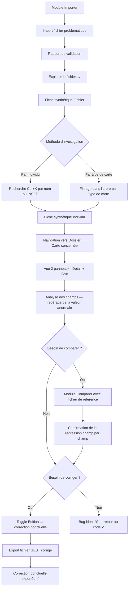
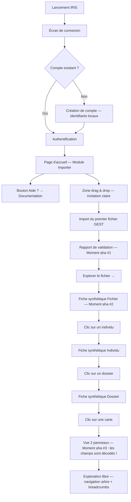

# UX Design Specification - IRIS

**Author:** Negus
**Date:** 2026-03-22

---

<!-- UX design content will be appended sequentially through collaborative workflow steps -->

## Executive Summary

### Vision Projet

IRIS est le premier et seul éditeur dédié au format GEST — un format à largeur fixe (204 caractères/ligne) utilisé massivement dans la paie publique française. Aucun outil spécialisé n'existe : gestionnaires de paie, chefs de projet et développeurs manipulent ces fichiers dans des éditeurs de texte brut, comptant manuellement les positions de caractères. IRIS transforme ce format opaque en données structurées, lisibles et éditables.

La refonte passe de Tauri + React vers Tauri dernière version + Svelte/SvelteKit, offrant une réactivité fine, un routing natif et des transitions fluides.

Stack cible : Tauri (dernière version) + Svelte/SvelteKit. Application desktop 100% locale, Windows en priorité.

### Utilisateurs Cibles

| Profil | Rôle | Besoin principal | Compétence tech |
|--------|------|------------------|-----------------|
| **Sophie** | Gestionnaire de paie | Visualiser, corriger et exporter des fichiers GEST | Faible — utilisatrice métier |
| **Marc** | Chef de projet logiciel paie | Comparer des fichiers GEST avant/après migration | Moyenne |
| **Karim** | Développeur logiciel paie | Investiguer des bugs dans les fichiers GEST | Élevée |
| **Amélie** | Nouvel utilisateur | Première prise en main intuitive | Variable |

### Défis de Design Clés

1. **Données denses et techniques** — 31 types de cartes avec des dizaines de champs chacun. Rendre les données lisibles et navigables sans submerger les utilisateurs non techniques.
2. **Double audience** — L'interface doit servir des gestionnaires de paie (simplicité, clarté) et des développeurs (accès rapide, filtrage puissant, données brutes) sans compromis.
3. **Édition sécurisée d'un format rigide** — Modifier un champ dans un format à largeur fixe sans casser la structure. L'UX doit inspirer confiance et rendre les erreurs impossibles.
4. **Application desktop Windows** — Contexte administration française, machines potentiellement contraintes. Interface rapide, légère, respectant les conventions desktop natives.

### Opportunités de Design

1. **Moment "aha" à l'ouverture** — Le passage instantané de 204 caractères bruts à des données structurées avec libellés est un moment WOW à maximiser visuellement.
2. **Navigation contextuelle intelligente** — Exploiter les relations naturelles du format GEST (individu → cartes → champs) pour créer une navigation hiérarchique intuitive de type master-detail.
3. **Comparaison visuelle côte à côte** — Aller au-delà d'un simple tableau de différences : montrer visuellement les écarts dans leur contexte, avec code couleur et navigation par différence.

## Core User Experience

### Expérience Définissante

L'expérience cœur d'IRIS est le **moment de transformation** : l'utilisateur dépose ou sélectionne un fichier GEST — 204 caractères bruts par ligne — et en quelques secondes, IRIS le décode automatiquement en données structurées, validées et lisibles. Détection d'encodage, identification des 31 types de cartes, validation multi-niveaux : tout est automatique. L'utilisateur n'a rien à configurer, rien à paramétrer.

Ce moment fondateur conditionne tout le reste. Si l'import est fluide et le résultat immédiatement lisible, l'utilisateur fait confiance à l'outil pour visualiser, modifier, comparer et exporter.

### Stratégie Plateforme

| Critère | Décision |
|---------|----------|
| **Plateforme** | Desktop Windows (MVP), Linux/macOS post-MVP |
| **Input** | Souris + clavier (pas de tactile) |
| **Connectivité** | 100% offline, aucune dépendance réseau |
| **Framework** | Tauri dernière version + Svelte/SvelteKit |
| **Résolution** | Standard desktop (1920x1080 minimum recommandé) |

### Interactions Sans Friction

Les étapes suivantes doivent être **entièrement automatiques**, sans intervention utilisateur :

1. **Détection d'encodage** — Windows-1252 détecté et géré transparemment
2. **Parsing et décodage** — Identification automatique de chaque type de carte parmi les 31 supportés
3. **Validation à l'import** — Longueur des lignes (204 car.), encodage, schéma par type de carte
4. **Rapport de validation** — Affiché automatiquement après import avec lignes OK/KO et détail des erreurs

L'utilisateur ne doit jamais avoir à :
- Spécifier le format ou l'encodage du fichier
- Configurer les types de cartes à reconnaître
- Lancer manuellement une validation

### Moments Critiques de Succès

| Moment | Ce qui se passe | Critère de succès |
|--------|----------------|-------------------|
| **Ouverture d'un fichier** | 204 caractères bruts → données structurées avec libellés | Compréhension immédiate, effet "aha" |
| **Première navigation** | L'utilisateur trouve un individu et ses cartes | < 3 clics pour atteindre n'importe quelle donnée |
| **Première modification** | Édition d'un champ avec validation temps réel | Confiance totale — impossible de corrompre le fichier |
| **Première comparaison** | Différences affichées visuellement, champ par champ | Identification immédiate des écarts sans effort d'interprétation |
| **Premier export** | Fichier GEST valide produit après modification | Validation automatique avant export, zéro doute |

### Principes d'Expérience

1. **Clarté instantanée** — Chaque écran transforme des données opaques en information compréhensible. Aucune donnée ne doit nécessiter un effort d'interprétation de la part de l'utilisateur.
2. **Zéro configuration** — L'application sait ce qu'est un fichier GEST. L'utilisateur n'a jamais à enseigner quoi que ce soit à l'outil.
3. **Confiance par la contrainte** — L'édition rend les erreurs impossibles, pas juste signalées. L'utilisateur ne peut pas produire un fichier invalide.
4. **Accès progressif à la complexité** — L'interface expose d'abord l'essentiel (individus, cartes, champs lisibles), puis permet de descendre dans le détail (données brutes, filtres avancés) pour les utilisateurs experts.

## UX Pattern Analysis & Inspiration

### Analyse des Produits Inspirants

L'analyse de 30 applications sur 4 axes UX identifie trois inspirations fondatrices pour IRIS :

**Wireshark** — Architecture trois panneaux synchronisés (liste → détail décodé → données brutes). C'est le paradigme exact pour afficher liste de lignes → champs structurés → ligne brute de 204 caractères. Synchronisation bidirectionnelle entre panneaux.

**ImHex** — Segmentation colorée des champs dans la vue brute. Chaque plage positionnelle reçoit une couleur distincte, rendant la structure visible sans décodage mental. Synchronisation bidirectionnelle arbre ↔ vue brute.

**Beyond Compare (Table Compare)** — Comparaison cellule par cellule alignée sur clés primaires, avec tolérance numérique pour les arrondis. Directement applicable à la comparaison de fichiers GEST par matricule.

**Autres contributions majeures :**

| Application | Contribution clé |
|-------------|-----------------|
| **VS Code** | Breadcrumbs hiérarchiques, validation JSON Schema temps réel, diff inline/côte-à-côte |
| **Linear** | Navigation « inverted L-shape », densité maîtrisée, palette Cmd+K |
| **Monaco Constrained Editor** | Édition contrainte par plage — corruption structurellement impossible |
| **SAP Fiori** | MaskInput positionnel, MessagePopover navigable, mécanisme de brouillon |
| **Excel Data Validation** | Modèle à trois niveaux de sévérité Stop/Warning/Info |
| **Qt Framework** | Validation à trois états Acceptable/Intermediate/Invalid |
| **TablePlus** | Basculement grille ↔ formulaire, change-tracking « code review » |
| **Kaleidoscope** | Double encodage couleur + symbole pour accessibilité daltoniens |
| **Datafold** | Workflow résumé statistique → drill-down progressif |
| **Beekeeper Studio** | Chrome de couleur par contexte, philosophie « clarté > complétude » |

### Patterns UX Transférables

#### Axe 1 — Visualisation de données denses

1. **Architecture trois panneaux synchronisés** — Panneau supérieur : liste des lignes en tableau synthétique coloré par type. Panneau central : champs de la ligne sélectionnée en arbre/formulaire. Panneau inférieur : ligne brute de 204 caractères avec segmentation colorée. Sélection synchronisée entre les trois.
2. **Segmentation colorée de la vue brute** — Alternance de teintes de fond par champ, infobulle au survol (nom, type, valeurs autorisées, valeur décodée).
3. **Basculement grille ↔ formulaire** — Vue grille pour navigation rapide, vue formulaire pour édition détaillée.

#### Axe 2 — Navigation hiérarchique à 5 niveaux

La hiérarchie des données GEST comporte 5 niveaux : **Fichier → Individu (INSEE) → Dossier de paie (NUDOS) → Carte → Champ**. Un individu peut posséder plusieurs dossiers de paie identifiés par leur numéro de dossier (NUDOS), chaque dossier contenant ses propres cartes.

1. **Arbre + panneau détail + breadcrumbs** — Sidebar arbre (Fichier → Individus → Dossiers → Cartes), panneau droit (Champs en formulaire/grille), breadcrumbs cliquables avec dropdown des frères (ex. `DADS2024.txt > Dupont Marie > Dossier 01 > Carte 40 > RIB`).
2. **Navigation « inverted L-shape »** — Sidebar pour niveaux 1-3 (fichier, individus, dossiers de paie), barre d'en-tête pour niveau 4 (cartes en onglets/dropdown), contenu central pour niveau 5 (champs éditables). Palette Cmd+K pour saut direct par nom, INSEE ou numéro de dossier.
3. **Miller columns** — 5 colonnes simultanées (Fichiers | Individus | Dossiers | Cartes | Champs). Exigeant en largeur d'écran — réservé aux résolutions élevées ou comme mode alternatif.

#### Axe 3 — Édition sécurisée

1. **Édition contrainte par plage** — Chaque champ = plage éditable avec coordonnées fixes, zones structurelles en lecture seule, frappes invalides rejetées silencieusement.
2. **Validation trois états** — Acceptable (vert) / Intermediate (neutre, en cours de saisie) / Invalid (rouge). Élimine la validation prématurée hostile.
3. **Communication avant-pendant-après + aperçu avant commit** — Avant : label avec nom, type, longueur, positions. Pendant : masque, indicateur de progression. Après : aperçu des modifications surlignées + liste navigable d'erreurs.

#### Axe 4 — Comparaison

1. **Comparaison tabulaire alignée sur clés primaires** — Appariement par matricule, comparaison champ par champ, tolérance numérique configurable, colonnes masquables.
2. **Résumé statistique → drill-down progressif** — Dashboard d'abord (identiques, modifiés, nouveaux, supprimés), puis détail par catégorie.
3. **Double encodage couleur + symbole** — Couleurs ET icônes (+/−/~) pour accessibilité. Minimap latéral. Zones inchangées repliables. Navigation Suivant/Précédent.

### Anti-Patterns à Éviter

- **Éditeur générique sans connaissance du format** — Pas de Notepad++/Excel qui force l'utilisateur à décoder mentalement
- **Auto-save sur données sensibles** — Workflow explicite « Write Changes / Revert Changes » obligatoire
- **Validation binaire prématurée** — Ne pas marquer un champ invalide alors que la saisie est en cours (état Intermediate)
- **Modales d'alerte agressives** — Préférer les indicateurs inline et le MessagePopover navigable
- **Surcharge fonctionnelle** — Prioriser la clarté sur la complétude (philosophie Beekeeper Studio)

### Stratégie d'Inspiration Design

**Adopter directement :**
- Architecture trois panneaux synchronisés (Wireshark) — identité fondamentale d'IRIS
- Segmentation colorée de la vue brute (ImHex) — rend les 204 caractères instantanément compréhensibles
- Comparaison tabulaire alignée sur clés (Beyond Compare) — comparaison systématique de fichiers de paie
- Double encodage couleur + symbole (Kaleidoscope) — accessibilité obligatoire pour outil administratif

**Adapter :**
- Breadcrumbs + palette Cmd+K (VS Code/Linear) — adapter aux 5 niveaux Fichier → Individu → Dossier → Carte → Champ
- Validation trois états (Qt) — adapter aux contraintes de format fixe et règles métier GEST
- Change-tracking « code review » (TablePlus) — adapter au workflow aperçu avant écriture fichier

**Éviter :**
- Approche « éditeur de texte amélioré » — IRIS n'est pas un éditeur de texte, c'est un décodeur de format
- Interface qui « représente » le format au lieu de « l'être » — l'interface doit être la structure GEST rendue visible et manipulable

**Principe fondateur :** Les applications les plus réussies ne « montrent » pas les données — leur hiérarchie visuelle EST la hiérarchie des données. IRIS ne devrait pas représenter le format de 204 caractères, elle devrait être ce format, rendu visible et manipulable.

## Design System Foundation

### Choix du Design System

**Approche hybride : shadcn-svelte + composants custom**

| Couche | Technologie | Périmètre |
|--------|-------------|-----------|
| **Fondation CSS** | Tailwind CSS | Utilitaires, tokens de design, responsive, cohérence visuelle |
| **Composants standards** | shadcn-svelte (Bits UI headless) | Boutons, formulaires, modales, navigation, tabs, toasts, dropdowns, menus |
| **Composants métier IRIS** | Custom Svelte | Panneaux synchronisés, vue brute segmentée, édition contrainte, grille de comparaison, arbre hiérarchique |

### Justification du Choix

1. **Vitesse sur le non-différenciant** — shadcn-svelte fournit ~80% des composants d'interface standards (navigation, formulaires, feedback) prêts à l'emploi et personnalisables, accélérant le développement pour un développeur solo.
2. **Contrôle total sur le différenciant** — Les composants cœur d'IRIS (architecture trois panneaux Wireshark, segmentation colorée ImHex, édition contrainte par plage, comparaison tabulaire) sont trop spécifiques pour un design system générique et doivent être conçus sur mesure.
3. **Philosophie « own your components »** — shadcn-svelte copie les composants dans le projet (pas de dépendance npm externe), donnant un contrôle total sur le code source. Pas de compromis imposé par une bibliothèque tierce.
4. **Écosystème natif Svelte** — shadcn-svelte et Bits UI sont construits pour Svelte/SvelteKit, sans couche d'abstraction ou de portage.
5. **Cohérence via Tailwind** — Tailwind CSS assure une cohérence visuelle transversale entre composants shadcn et composants custom via des tokens partagés (couleurs, espacements, typographie).

### Approche d'Implémentation

**Composants shadcn-svelte (standards) :**
- Navigation : Sidebar, Breadcrumb, Tabs, Command Palette (Cmd+K)
- Formulaires : Input, Select, Checkbox, Label, Form validation
- Feedback : Toast, Alert, Dialog, Popover (base pour MessagePopover)
- Layout : Card, Separator, ScrollArea, Resizable (panneaux redimensionnables)
- Data : Table (base pour les grilles), Badge, Tooltip

**Composants custom IRIS (métier) :**
- `GestTriplePanel` — Architecture trois panneaux synchronisés (liste / détail / vue brute)
- `GestRawView` — Vue brute 204 caractères avec segmentation colorée par champ
- `GestFieldEditor` — Édition contrainte par plage avec validation trois états
- `GestHierarchyTree` — Arbre de navigation Fichier → Individu → Dossier → Carte
- `GestCompareGrid` — Grille de comparaison tabulaire alignée sur clés primaires
- `GestDiffSummary` — Tableau de bord de comparaison avec drill-down
- `GestValidationPanel` — Panneau de validation avec liste navigable d'erreurs

### Stratégie de Personnalisation

**Tokens de design (via Tailwind) :**
- Palette de couleurs IRIS : couleurs métier pour types de cartes, états de validation (Acceptable/Intermediate/Invalid), types de différences (+/−/~)
- Typographie : police monospace pour la vue brute, sans-serif pour l'interface
- Espacements : densité adaptée aux données tabulaires (compact par défaut)
- Bordures et ombres : style discret, navigation visuellement atténuée (principe Linear)

**Thème :**
- Mode clair par défaut (contexte administratif)
- Mode sombre envisageable post-MVP
- Chrome de couleur par contexte de fichier (production = rouge, recette = orange, test = vert)

**Accessibilité :**
- WCAG 2.1 A minimum (MVP)
- Double encodage couleur + symbole systématique (accessibilité daltoniens)
- Navigation clavier complète
- Contrastes suffisants sur tous les états de validation

## Expérience Utilisateur Détaillée

### Expérience Définissante

**En une phrase :** "Tu ouvres ton fichier GEST et en une seconde, tout est décodé — chaque champ, chaque carte, chaque individu. Tu vois enfin ce que tu manipulais à l'aveugle."

L'expérience fondatrice d'IRIS est le **passage de l'opaque au lisible** — le moment où 204 caractères bruts deviennent des données structurées avec libellés. C'est le moment qui rend tout le reste possible : naviguer, modifier, comparer, exporter.

### Modèle Mental Utilisateur

**Modèle actuel :** Les utilisateurs pensent en positions de caractères. Ils savent que "le RIB commence à la position 45" et comptent manuellement. Leur modèle est linéaire et positionnel.

**Workarounds actuels :** Copier-coller dans Excel, macros Notepad++ pour coloriser, documentation papier du format GEST à côté de l'écran.

**Modèle cible avec IRIS :** Les utilisateurs pensent en **individus, dossiers et cartes** — pas en positions. La vue brute reste accessible (respect du modèle mental positionnel) mais n'est plus le point d'entrée. IRIS augmente le modèle mental existant au lieu de le remplacer.

### Architecture de Navigation

**Sidebar multi-niveaux (pattern VS Code / Linear) :**

**Niveau 1 — Barre d'icônes (toujours visible) :**

| Module | Rôle |
|--------|------|
| **Importer** | Point d'entrée — import de fichiers GEST |
| **Explorer** | Cœur de l'application — visualisation + édition intégrée |
| **Comparer** | Comparaison multi-fichiers avec dashboard |

L'export est une **action contextuelle** (bouton dans la barre d'outils d'Explorer et Comparer), pas un module distinct.

**Niveau 2 — Panneau contextuel (s'ouvre selon le module) :**

| Module | Contenu niveau 2 |
|--------|------------------|
| **Importer** | Zone drag & drop, historique des imports, fichiers en cours |
| **Explorer** | Arbre hiérarchique : Fichier → Individu → Dossier (NUDOS) → Carte |
| **Comparer** | Sélection fichier référence / cibles, historique des comparaisons |

**Zone centrale — Écran principal :**
- Explorer + carte sélectionnée → Trois panneaux synchronisés (liste / détail champs / vue brute segmentée)
- Comparer + comparaison en cours → Dashboard de différences + drill-down

Le niveau 2 peut se replier pour maximiser l'espace de travail.

### Mode Édition (Toggle)

L'édition est intégrée dans le module Explorer via un toggle explicite :

| Aspect | Mode Lecture (défaut) | Mode Édition (toggle activé) |
|--------|----------------------|------------------------------|
| **Champs** | Lecture seule, consultation libre | Éditables avec validation contrainte par plage |
| **Indicateur visuel** | Aucun | Badge/indicateur clair que le mode est actif |
| **Modifications** | — | Compteur de modifications pendantes visible en permanence |
| **Actions** | — | Boutons "Enregistrer" / "Annuler tout" visibles |
| **Workflow** | Navigation libre | Édition → aperçu des changements → enregistrement explicite |

Le toggle protège contre les modifications accidentelles sur des données de paie sensibles. Pas d'auto-save — workflow explicite "Write Changes / Revert Changes".

### Critères de Succès de l'Expérience Cœur

| Critère | Cible |
|---------|-------|
| Temps entre ouverture de fichier et compréhension d'une donnée | Immédiat (< 1s) |
| Nombre de clics pour atteindre n'importe quel champ | ≤ 3 |
| Fichiers GEST corrompus après édition | 0% |
| Workflow complet import → modification → export | < 30 secondes |
| Temps d'apprentissage pour un nouvel utilisateur | < 5 minutes |

### Patterns UX Utilisés

**Combinaison innovante de patterns établis** — pas d'invention d'interactions nouvelles :
- Trois panneaux synchronisés (Wireshark) — pour la traduction brut → structuré
- Segmentation colorée (ImHex) — pour rendre la vue brute lisible
- Sidebar multi-niveaux + arbre hiérarchique (VS Code, Linear, pgAdmin) — pour la navigation à 5 niveaux
- Édition contrainte par plage (Monaco Constrained Editor) — pour la sécurité d'édition
- Change-tracking avec aperçu avant commit (TablePlus, DB Browser) — pour la confiance

L'innovation réside dans la combinaison de ces patterns, appliquée au domaine spécifique du format GEST.

## Visual Design Foundation

### Système de Couleurs

**Palette principale — Tons neutres froids (style Linear/VS Code) :**

| Token | Rôle | Valeur |
|-------|------|--------|
| `--bg-primary` | Fond principal | Blanc cassé froid (#FAFAFA) |
| `--bg-secondary` | Fond panneaux / sidebar | Gris très clair (#F4F4F5) |
| `--bg-tertiary` | Survol éléments interactifs | Gris clair (#E4E4E7) |
| `--text-primary` | Texte principal | Gris très foncé (#18181B) |
| `--text-secondary` | Texte secondaire / labels | Gris moyen (#71717A) |
| `--text-muted` | Texte désactivé / hints | Gris clair (#A1A1AA) |
| `--border` | Bordures et séparateurs | Gris subtil (#E4E4E7) |
| `--accent` | Couleur d'accentuation / sélection | Bleu sobre (#3B82F6) |

**Couleurs sémantiques — États et feedback :**

| Token | Rôle | Valeur |
|-------|------|--------|
| `--valid` | Acceptable / succès | Vert (#22C55E) |
| `--intermediate` | En cours de saisie / avertissement | Ambre (#F59E0B) |
| `--invalid` | Erreur / invalide | Rouge (#EF4444) |
| `--info` | Information contextuelle | Bleu clair (#60A5FA) |

**Couleurs de comparaison (diff) :**

| Token | Rôle | Valeur | Symbole |
|-------|------|--------|---------|
| `--diff-added` | Ajout | Vert fond (#DCFCE7) | `+` |
| `--diff-removed` | Suppression | Rouge fond (#FEE2E2) | `−` |
| `--diff-modified` | Modification | Bleu fond (#DBEAFE) | `~` |

**Couleurs de segmentation — Vue brute 204 caractères :**

Palette de 8 teintes pastel alternées pour la segmentation colorée des champs dans la vue brute. Teintes suffisamment distinctes pour différencier les champs adjacents, suffisamment douces pour ne pas fatiguer sur de longues sessions.

**Chrome de contexte fichier :**

| Contexte | Bordure/indicateur |
|----------|-------------------|
| Production | Rouge discret |
| Recette | Orange discret |
| Test | Vert discret |

### Système Typographique

**Polices :**

| Usage | Police | Justification |
|-------|--------|---------------|
| **Interface** | Inter (sans-serif) | Lisibilité optimale pour interfaces data-dense, excellente à petite taille, largement adoptée (Linear, GitHub) |
| **Vue brute / données positionnelles** | JetBrains Mono (monospace) | Alignement parfait des caractères par position — essentiel pour la vue 204 caractères |
| **Valeurs décodées** | Inter | Cohérence avec l'interface |

**Échelle typographique (base 14px) :**

| Token | Taille | Usage |
|-------|--------|-------|
| `--text-xs` | 11px | Positions de caractères, métadonnées secondaires |
| `--text-sm` | 12px | Labels de champs, texte compact dans les grilles |
| `--text-base` | 14px | Texte principal, valeurs de champs |
| `--text-lg` | 16px | Titres de sections, noms d'individus |
| `--text-xl` | 18px | En-têtes de panneaux |
| `--text-2xl` | 24px | Titre de page / nom de fichier |

**Hauteur de ligne :** 1.4 pour le texte d'interface, 1.0 pour la vue brute monospace (alignement strict).

### Espacement & Layout

**Unité de base : 4px**

| Token | Valeur | Usage |
|-------|--------|-------|
| `--space-1` | 4px | Padding interne minimal, gap entre icône et label |
| `--space-2` | 8px | Espacement entre éléments d'un même groupe |
| `--space-3` | 12px | Padding de cellules, marge entre groupes |
| `--space-4` | 16px | Padding de panneaux, marge entre sections |
| `--space-6` | 24px | Séparation entre blocs majeurs |
| `--space-8` | 32px | Marge externe de page |

**Densité :** Compacte par défaut — optimisée pour afficher un maximum de données sans surcharger. Les grilles et tableaux utilisent `--space-2` / `--space-3` pour le padding cellulaire.

**Layout :**

| Zone | Dimensions |
|------|-----------|
| **Sidebar niveau 1** | 48px de large (icônes seules) |
| **Sidebar niveau 2** | 240-320px (redimensionnable) |
| **Zone centrale** | Espace restant, divisé en panneaux redimensionnables |
| **Barre d'outils / breadcrumbs** | 40px de haut |

Les panneaux (trois panneaux synchronisés) sont séparés par des séparateurs redimensionnables (pattern Resizable de shadcn-svelte). Proportions par défaut : 40% liste / 40% détail / 20% vue brute, ajustables par l'utilisateur.

### Accessibilité

**Contraste :**
- Texte principal sur fond : ratio ≥ 4.5:1 (WCAG AA)
- Texte secondaire sur fond : ratio ≥ 3:1 (WCAG AA pour texte large)
- États de validation (valid/intermediate/invalid) : contraste suffisant ET symbole associé

**Double encodage systématique :**
- Couleurs de diff toujours accompagnées d'icônes (+/−/~)
- États de validation : couleur + icône (checkmark/hourglass/cross)
- Segmentation vue brute : couleur + infobulle au survol

**Navigation clavier :**
- Tous les éléments interactifs accessibles au Tab
- Raccourcis clavier pour les actions fréquentes (Cmd+K palette, navigation entre panneaux)
- Focus visible et contrasté

**Taille minimale des cibles :** 32px pour les éléments cliquables (conformité WCAG 2.1 A).

## Design Direction Decision

### Directions Explorées

6 directions de design ont été générées et évaluées via un showcase HTML interactif (`ux-design-directions.html`), puis un prototype interactif complet (`ux-explorer-preview.html`) :

| Direction | Vue | Verdict |
|-----------|-----|---------|
| **A** | Explorer — 3 panneaux verticaux synchronisés | **Retenue puis affinée** → 2 panneaux (détail + vue brute) |
| **B** | Explorer — Fiche centrée individu | **Retenue** — Fiches synthétiques pour niveaux Fichier, Individu, Dossier |
| **C** | Explorer — Data-dense compacte | **Écartée** — Doublon avec A, panneau latéral incompatible avec vue brute 204 car. |
| **D** | Comparer — Dashboard + grille de différences | **Retenue** — Module Comparer |
| **E** | Importer — Drag & drop + fichiers récents | **Retenue** — Module Importer |
| **F** | Rapport de validation — Métriques + erreurs | **Retenue** — Écran post-import |

### Direction Retenue — Architecture Explorer

**4 types de vues selon le niveau sélectionné dans l'arbre :**

| Sélection dans l'arbre | Type de vue | Contenu |
|------------------------|-------------|---------|
| **Fichier (Bande GEST)** | Fiche synthétique | En-tête de bande décodé (correspondance, date paye, chaîne, ministère, département), métriques (lignes OK/KO, types de cartes, nb individus), liste cliquable des individus |
| **Individu (INSEE)** | Fiche synthétique | INSEE, nom, nombre de dossiers, résumé par dossier avec types de cartes, liste cliquable des dossiers |
| **Dossier (NUDOS)** | Fiche synthétique | NUDOS, individu parent, liste des cartes avec type, libellé et aperçu des premiers champs, liste cliquable des cartes |
| **Carte** | 2 panneaux verticaux | Panneau haut : champs décodés (formulaire structuré avec libellés, positions, valeurs décodées). Panneau bas : vue brute 204 caractères sur toute la largeur, segmentation colorée par champ |

**Synchronisation bidirectionnelle complète :**
- Cliquer dans l'arbre → la vue centrale change
- Cliquer dans une fiche synthétique (sur un individu, dossier, carte) → l'arbre se synchronise + la vue change
- Breadcrumbs cliquables pour remonter à n'importe quel niveau
- Survol d'un champ dans le panneau détail → surlignage du segment dans la vue brute
- Boutons ◀ ▶ dans le panneau détail pour naviguer entre cartes du même dossier

**Layout final du module Explorer :**

```
┌──────────────────────────────────────────────────────┐
│ Sidebar L1 │ Sidebar L2 (arbre)  │ Toolbar + breadcrumbs          │
│ (icônes)   │ Fichier             │────────────────────────────────│
│            │  └ Individu         │                                │
│ Importer   │    └ Dossier 01     │  VUE CONTEXTUELLE              │
│ Explorer ● │      └ Carte 40 ●   │                                │
│ Comparer   │      └ Carte 01     │  Fichier → Fiche synthétique   │
│            │    └ Dossier 02     │  Individu → Fiche synthétique  │
│            │  └ Individu 2       │  Dossier → Fiche synthétique   │
│            │                     │  Carte → 2 panneaux :          │
│ ─────────  │                     │    Détail champs [◀ 2/4 ▶]     │
│ Paramètres │                     │    ── ↕ redimensionnable ──    │
│            │                     │    Vue brute 204 car.          │
└──────────────────────────────────────────────────────┘
```

### Justification des Décisions Clés

1. **2 panneaux au lieu de 3** — Le panneau grille (liste des cartes) faisait triple emploi avec l'arbre et les fiches synthétiques. Sa suppression libère de l'espace vertical pour le détail et la vue brute.
2. **Fiches synthétiques aux niveaux intermédiaires** — Fichier, Individu et Dossier ne sont pas des lignes du fichier mais des regroupements logiques. Une fiche synthétique avec listes cliquables est plus naturelle qu'une grille vide.
3. **Vue brute sur toute la largeur** — Les 204 caractères s'affichent sur une seule ligne sans retour à la ligne, préservant l'alignement positionnel.
4. **Navigation ◀ ▶ dans le détail** — Compense la suppression de la grille en permettant de naviguer entre cartes du même dossier sans quitter la vue.

### Intégration des Autres Modules

- **Module Comparer** — Layout propre : dashboard statistique (identiques, modifiés, absents, nouveaux), navigation Précédent/Suivant entre différences, filtres par type, grille de comparaison champ par champ avec double encodage couleur + symbole.
- **Module Importer** — Zone drag & drop centrée + liste des fichiers récemment importés, menant au rapport de validation.
- **Rapport de validation** — Écran transitoire post-import avec métriques en cartes (lignes OK/KO, types, individus) et liste navigable d'erreurs. Bouton "Explorer le fichier →" pour basculer vers l'Explorer.

## User Journey Flows

### Parcours 1 — Sophie : Import → Visualisation → Modification → Export

**Objectif :** Contrôler et corriger un fichier GEST avant envoi en paie. Workflow complet en < 30 secondes.



**Points clés du flow :**
- L'import mène automatiquement au rapport de validation → pas d'étape manuelle
- La navigation se fait par clics successifs dans les fiches synthétiques (Fichier → Individu → Dossier → Carte) ou directement dans l'arbre
- Le toggle Édition protège contre les modifications accidentelles
- L'export inclut un aperçu obligatoire des modifications et une validation complète
- Chaque étape donne un feedback visuel clair (compteur, validation, surlignage)

---

### Parcours 2 — Marc : Comparaison de migration

**Objectif :** Valider que les fichiers GEST produits après migration sont identiques à ceux de référence.



**Points clés du flow :**
- Les deux fichiers doivent être importés d'abord (via le module Importer)
- Le module Comparer permet de sélectionner référence et cible parmi les fichiers importés
- Options de comparaison : exclusion de types de cartes, tolérance numérique pour les arrondis
- Dashboard d'abord (vue d'ensemble), puis drill-down progressif
- Navigation fluide entre différences avec compteur et filtres par type
- Export direct en Excel depuis le module Comparer

---

### Parcours 3 — Karim : Investigation et debug

**Objectif :** Identifier un bug dans les fichiers GEST générés par le logiciel de paie.



**Points clés du flow :**
- Karim utilise principalement la recherche Ctrl+K pour sauter directement à un individu
- Le filtrage par type de carte dans l'arbre permet de cibler l'investigation
- La vue brute segmentée est particulièrement utile pour Karim — il connaît les positions
- La bascule vers le module Comparer est fluide si besoin de confirmer une régression
- La correction ponctuelle est un raccourci — pas le workflow principal de Karim

---

### Parcours 4 — Amélie : Première connexion

**Objectif :** Créer son compte, découvrir l'application, importer et comprendre son premier fichier GEST.



**Points clés du flow :**
- L'écran de connexion est le premier contact — doit être simple et rassurant
- Après authentification, Amélie arrive sur le module Importer avec une invitation claire à importer
- Le bouton Aide (?) dans la sidebar donne accès à la documentation (MVP) ; un parcours d'introduction interactif pourra être ajouté post-MVP
- 3 moments "aha" progressifs : (1) rapport de validation automatique, (2) fichier structuré avec individus, (3) champs décodés avec libellés
- L'interface auto-explicative (fiches synthétiques cliquables, arbre navigable, breadcrumbs) guide naturellement sans tutoriel
- Les données d'Amélie sont cloisonnées — elle ne voit que ses propres fichiers

---

### Patterns de Parcours Communs

**Pattern de navigation :**
- Toujours : arbre + breadcrumbs + fiches cliquables comme 3 chemins parallèles pour naviguer
- Ctrl+K disponible partout pour saut direct par nom, INSEE ou numéro de dossier

**Pattern de feedback :**
- Import → rapport automatique (pas d'étape manuelle)
- Édition → compteur de modifications visible en permanence
- Export → aperçu obligatoire + validation avant écriture

**Pattern d'erreur :**
- Jamais de modale bloquante — toujours des listes navigables d'erreurs
- Clic sur une erreur → navigation vers l'élément concerné
- Ton neutre et informatif, pas alarmiste

**Pattern de transition entre modules :**
- Importer → (rapport) → Explorer : flux automatique
- Explorer → Comparer : bascule via sidebar L1, fichiers déjà importés disponibles
- Explorer/Comparer → Export : action contextuelle (bouton dans la barre d'outils)

### Principes d'Optimisation des Flows

1. **Minimum de clics vers la valeur** — Import → compréhension des données en 3 clics maximum
2. **Pas d'étape morte** — Chaque écran apporte de l'information ou permet une action
3. **Retour arrière toujours possible** — Breadcrumbs + arbre permettent de remonter à tout moment
4. **Contexte toujours visible** — L'arbre et les breadcrumbs montrent toujours où l'on est dans la hiérarchie
5. **Actions irréversibles protégées** — Toggle édition, aperçu avant export, pas d'auto-save

## Component Strategy

### Composants shadcn-svelte (Disponibles)

| Catégorie | Composants | Usage dans IRIS |
|-----------|-----------|-----------------|
| **Navigation** | Sidebar, Breadcrumb, Tabs, Command (Cmd+K) | Sidebar L1/L2, breadcrumbs, onglets dossiers, palette de recherche |
| **Formulaires** | Input, Select, Checkbox, Label, Switch | Champs d'édition, toggle mode édition, options de comparaison |
| **Feedback** | Toast, Alert, Popover, Tooltip | Notifications, messages de validation, infobulles sur la vue brute |
| **Layout** | Card, Separator, ScrollArea, Resizable | Fiches synthétiques, séparateur de panneaux redimensionnable |
| **Data** | Table, Badge, Tooltip | Grilles de comparaison, badges de type de carte |
| **Overlay** | Dialog, Sheet | Aperçu avant export, boîtes de confirmation |

**Couverture :** ~70% des besoins d'interface sont couverts par shadcn-svelte.

### Composants Custom IRIS

#### `GestRawView` — Vue brute segmentée

**Objectif :** Afficher une ligne de 204 caractères avec segmentation colorée par champ et synchronisation avec le panneau détail.

| Aspect | Spécification |
|--------|--------------|
| **Props** | `line: string` (204 car.), `fields: FieldDefinition[]`, `highlightedField: number \| null` |
| **Events** | `on:field-hover(index)`, `on:field-click(index)` |
| **Rendu** | Police JetBrains Mono, chaque champ = `<span>` avec fond coloré alterné (palette 8 teintes pastel) |
| **Interaction** | Survol d'un segment → infobulle (nom, type, positions, valeur décodée). Clic → sélection du champ correspondant dans le détail |
| **Sync** | Prop `highlightedField` surligne le segment correspondant (outline dorée) |
| **États** | Normal, champ surligné (sync détail), champ sélectionné (clic) |
| **Accessibilité** | `role="list"`, chaque segment `role="listitem"` avec `aria-label="[nom du champ]: [valeur]"` |

#### `GestFieldEditor` — Édition contrainte par plage

**Objectif :** Éditer un champ d'une carte GEST avec validation temps réel et contraintes de format.

| Aspect | Spécification |
|--------|--------------|
| **Props** | `field: FieldDefinition`, `value: string`, `readonly: boolean`, `severity: 'stop' \| 'warning' \| 'info'` |
| **Events** | `on:change(newValue)`, `on:validation-state(state)` |
| **Validation 3 états** | Acceptable (bordure verte + ✓), Intermediate (neutre/ambre + ⏳), Invalid (rouge + ✗) |
| **Contraintes** | Masque positionnel, restriction de caractères par type, longueur maximale fixe |
| **Indicateur** | Compteur de progression `3/8 caractères`, label permanent (nom, type, positions) |
| **Sévérité** | Stop = bloque la saisie, Warning = avertit mais autorise avec confirmation, Info = notifie sans bloquer |
| **Accessibilité** | `aria-invalid`, `aria-describedby` pointant vers le message de validation, navigation clavier |

#### `GestHierarchyTree` — Arbre de navigation hiérarchique

**Objectif :** Naviguer dans la hiérarchie Fichier → Individu → Dossier → Carte avec synchronisation bidirectionnelle.

| Aspect | Spécification |
|--------|--------------|
| **Props** | `data: GestFileTree`, `selectedPath: TreePath`, `expandedNodes: Set<string>` |
| **Events** | `on:select(path)`, `on:expand(nodeId)`, `on:collapse(nodeId)` |
| **Niveaux** | 4 niveaux avec icônes différenciées (📄 fichier, 👤 individu, 📁 dossier, 📋 carte) |
| **Badges** | Compteur d'enfants sur chaque nœud |
| **Recherche** | Champ de recherche en haut, filtre en temps réel par nom, INSEE, NUDOS |
| **Sync** | La prop `selectedPath` synchronise la sélection avec la vue centrale |
| **États** | Normal, survolé, sélectionné (fond bleu + bordure gauche), déplié/replié |
| **Accessibilité** | `role="tree"`, `role="treeitem"`, `aria-expanded`, navigation clavier (flèches haut/bas, gauche/droite pour déplier/replier) |

#### `GestFicheSynthetique` — Fiche synthétique contextuelle

**Objectif :** Afficher un résumé structuré pour un Fichier, Individu ou Dossier avec listes d'enfants cliquables.

| Aspect | Spécification |
|--------|--------------|
| **Props** | `type: 'fichier' \| 'individu' \| 'dossier'`, `data: FicheData`, `children: ChildItem[]` |
| **Events** | `on:child-click(childPath)` |
| **Variantes** | **Fichier** : en-tête de bande décodé + métriques + liste individus. **Individu** : INSEE, nom + métriques + liste dossiers. **Dossier** : NUDOS + liste cartes avec aperçu champs |
| **Métriques** | Cartes stat avec bordure colorée (OK vert, KO rouge, info bleu, types violet) |
| **Listes** | Items cliquables avec icône, titre, détail, badges de type, flèche → |
| **Accessibilité** | Structure sémantique `<article>`, listes avec `role="list"`, items focusables |

#### `GestCompareGrid` — Grille de comparaison

**Objectif :** Afficher les différences entre deux fichiers GEST champ par champ avec navigation et filtrage.

| Aspect | Spécification |
|--------|--------------|
| **Props** | `differences: Difference[]`, `filters: FilterConfig`, `currentIndex: number` |
| **Events** | `on:navigate(index)`, `on:filter-change(filters)`, `on:export()` |
| **Colonnes** | Indicateur (+/−/~), INSEE, NUDOS, Individu, Type carte, Champ, Valeur référence, Valeur comparaison |
| **Coloration** | Lignes colorées par type de diff (vert ajout, rouge suppression, bleu modification) + icône dans la colonne indicateur |
| **Navigation** | Boutons ◀ ▶ avec compteur "Différence 12/47" |
| **Filtres** | Chips de filtre par type de changement et par type de carte |
| **Accessibilité** | `role="grid"`, `aria-rowcount`, `aria-colcount`, navigation clavier entre cellules |

#### `GestCompareDashboard` — Dashboard de comparaison

**Objectif :** Afficher un résumé statistique de la comparaison avec drill-down par catégorie.

| Aspect | Spécification |
|--------|--------------|
| **Props** | `stats: CompareStats`, `files: { reference: string, target: string }` |
| **Events** | `on:drill-down(category)`, `on:export()` |
| **Métriques** | Cartes cliquables : identiques (vert), modifiées (bleu), absentes (rouge), nouvelles (vert) |
| **Actions** | Clic sur une catégorie → filtre la grille de comparaison. Bouton export Excel |
| **Accessibilité** | Cartes focusables, `aria-label` décrivant chaque métrique |

#### `GestValidationPanel` — Panneau de validation

**Objectif :** Afficher les erreurs de validation avec navigation vers l'élément concerné.

| Aspect | Spécification |
|--------|--------------|
| **Props** | `errors: ValidationError[]`, `context: 'import' \| 'export'` |
| **Events** | `on:error-click(error)`, `on:dismiss()` |
| **Variante import** | Rapport post-import avec métriques (lignes OK/KO, types, individus) + liste d'erreurs |
| **Variante export** | Liste navigable d'erreurs restantes avant export (style MessagePopover SAP Fiori) |
| **Items** | Numéro de ligne (monospace), badge type d'erreur (LONGUEUR, ENCODAGE, SCHÉMA), message descriptif |
| **Interaction** | Clic sur une erreur → navigation vers la ligne/champ dans l'Explorer |
| **Accessibilité** | `role="log"`, `aria-live="polite"`, items focusables |

#### `GestChangeTracker` — Suivi des modifications

**Objectif :** Afficher le compteur de modifications pendantes et l'aperçu avant enregistrement.

| Aspect | Spécification |
|--------|--------------|
| **Props** | `changes: Change[]`, `isEditMode: boolean` |
| **Events** | `on:save()`, `on:revert()`, `on:preview()` |
| **Mode compact** | Badge dans la toolbar montrant le nombre de modifications pendantes |
| **Mode aperçu** | Dialog/Sheet montrant chaque modification : ancien → nouveau, surlignage vert/rouge (style code review) |
| **Actions** | "Enregistrer les changements" (primaire), "Annuler tout" (secondaire) |
| **Accessibilité** | Badge avec `aria-label="N modifications en attente"`, aperçu navigable au clavier |

### Stratégie d'Implémentation

**Principes :**
- Chaque composant custom est un composant Svelte autonome avec props typées et events
- Les composants utilisent les tokens Tailwind CSS pour la cohérence visuelle avec shadcn-svelte
- Chaque composant est testable unitairement (Vitest + Testing Library)
- Documentation des props/events via JSDoc dans le composant

**Structure de fichiers :**
```
src/lib/components/
├── ui/                    # shadcn-svelte (généré)
│   ├── button/
│   ├── breadcrumb/
│   ├── command/
│   └── ...
├── gest/                  # Composants custom IRIS
│   ├── GestRawView.svelte
│   ├── GestFieldEditor.svelte
│   ├── GestHierarchyTree.svelte
│   ├── GestFicheSynthetique.svelte
│   ├── GestCompareGrid.svelte
│   ├── GestCompareDashboard.svelte
│   ├── GestValidationPanel.svelte
│   └── GestChangeTracker.svelte
```

### Roadmap d'Implémentation

**Phase 1 — Fondations (Import + Explorer lecture seule) :**
- `GestHierarchyTree` — Navigation dans l'arbre
- `GestFicheSynthetique` — Fiches pour Fichier, Individu, Dossier
- `GestRawView` — Vue brute segmentée
- `GestValidationPanel` (variante import) — Rapport post-import

**Phase 2 — Édition :**
- `GestFieldEditor` — Édition contrainte par champ
- `GestChangeTracker` — Suivi et aperçu des modifications
- `GestValidationPanel` (variante export) — Validation avant export

**Phase 3 — Comparaison :**
- `GestCompareDashboard` — Dashboard statistique
- `GestCompareGrid` — Grille de différences avec navigation

## UX Consistency Patterns

### Hiérarchie des Actions

| Niveau | Style | Usage dans IRIS | Exemple |
|--------|-------|-----------------|---------|
| **Primaire** | Fond bleu (`--accent`), texte blanc | Action principale de l'écran — une seule par vue | "Explorer le fichier →", "Lancer la comparaison", "Enregistrer les changements" |
| **Secondaire** | Bordure grise, fond transparent | Actions alternatives ou complémentaires | "Annuler tout", "Exporter", boutons ◀ ▶ navigation |
| **Tertiaire** | Texte seul, sans bordure | Actions discrètes ou contextuelles | Liens dans les breadcrumbs, items cliquables dans les fiches |
| **Destructive** | Bordure rouge, texte rouge | Actions irréversibles | "Annuler toutes les modifications" (avec confirmation) |
| **Toggle** | Bordure grise → fond bleu quand actif | Bascule de mode | Toggle Édition |

**Règles :**
- Maximum 1 bouton primaire visible par vue
- Les actions destructives demandent toujours une confirmation (Dialog)
- Les boutons désactivés gardent leur label visible mais en `--text-muted`

### Patterns de Feedback

#### Validation — Modèle à 3 états

| État | Visuel | Comportement |
|------|--------|-------------|
| **Acceptable** | Bordure verte + ✓ | Champ complet et valide. Aucune action requise |
| **Intermediate** | Bordure ambre + ⏳ | Saisie en cours, pas encore complète. Pas de message d'erreur |
| **Invalid** | Bordure rouge + ✗ | Valeur non valide. Message d'erreur inline sous le champ |

**Règle anti-validation prématurée :** Ne jamais marquer un champ Invalid tant que l'utilisateur est en train de taper (état Intermediate). Ne passer en Invalid qu'après blur ou quand la valeur ne peut plus devenir valide.

#### Sévérité — Modèle à 3 niveaux

| Sévérité | Icône | Comportement | Usage |
|----------|-------|-------------|-------|
| **Stop** | 🚫 | Bloque la saisie ou l'action | Contrainte de format (caractère invalide, longueur dépassée) |
| **Warning** | ⚠️ | Avertit mais autorise avec confirmation | Valeur métier improbable mais techniquement légale |
| **Info** | ℹ️ | Notifie sans bloquer | Valeur inhabituelle, information contextuelle |

#### Notifications — Toasts

| Type | Couleur | Durée | Usage |
|------|---------|-------|-------|
| **Succès** | Vert (`--valid-bg`) | 3s auto-dismiss | Import réussi, export terminé, modifications enregistrées |
| **Erreur** | Rouge (`--invalid-bg`) | Persistant (dismiss manuel) | Échec d'import, erreur d'export |
| **Warning** | Ambre (`--intermediate-bg`) | 5s auto-dismiss | Fichier avec des lignes KO importé |
| **Info** | Bleu (`--accent-light`) | 3s auto-dismiss | Information contextuelle |

**Règles :**
- Les toasts apparaissent en bas à droite, empilés
- Jamais de modale bloquante pour des notifications — toujours des toasts ou des indicateurs inline
- Les erreurs critiques utilisent le `GestValidationPanel` (liste navigable), pas un toast

### Patterns de Navigation

#### Synchronisation bidirectionnelle

**Règle fondamentale :** Toute sélection dans n'importe quel élément de navigation (arbre, breadcrumbs, fiche synthétique, boutons ◀ ▶) met à jour tous les autres éléments de navigation et la vue centrale.

| Source de navigation | Met à jour |
|---------------------|-----------|
| Clic dans l'arbre | Vue centrale + breadcrumbs |
| Clic dans un breadcrumb | Arbre (sélection + dépliage) + vue centrale |
| Clic dans une fiche synthétique | Arbre (sélection + dépliage) + breadcrumbs + vue centrale |
| Boutons ◀ ▶ (navigation cartes) | Arbre (sélection) + breadcrumbs |
| Ctrl+K (palette de recherche) | Arbre (sélection + dépliage) + breadcrumbs + vue centrale |

#### Transitions entre vues

- Les transitions entre fiches synthétiques et vue carte sont **instantanées** (pas d'animation de page)
- Une animation `fade-in` subtile (200ms) accompagne le changement de contenu
- L'arbre s'anime au dépliage/repliage (150ms ease-out)

#### Transitions entre modules

| Transition | Comportement |
|-----------|-------------|
| Importer → (rapport) → Explorer | Automatique après import. Le fichier importé est sélectionné dans l'arbre |
| Explorer → Comparer | Bascule via sidebar L1. Les fichiers importés sont disponibles pour sélection |
| Explorer/Comparer → Export | Action contextuelle (bouton). Ouvre une boîte de dialogue native Tauri |

### Patterns de Formulaires

#### Champs d'édition GEST

- Chaque champ affiche en permanence : **nom**, **type**, **positions** (ex: `RIB · Alphanum · pos 42-46`)
- Pendant la saisie : masque positionnel + compteur de progression (`3/8`)
- Les frappes de caractères non autorisés par le type sont **silencieusement rejetées** (pas de message d'erreur)
- Le champ s'adapte visuellement à l'état de validation (bordure + icône)

#### Formulaire d'options de comparaison

- Checkboxes pour exclure des types de cartes de la comparaison
- Checkboxes pour inclure/exclure les champs de la partie commune des cartes (GCORR, datePaye, chaînePaye, numRemise, codeMIN, codeADM, codeDPT) — permet de concentrer la comparaison sur les données spécifiques aux cartes
- Input numérique pour la tolérance d'arrondi
- Valeurs par défaut sensées (aucune exclusion de type de carte, tous les champs communs inclus, tolérance 0)

### États Vides et Chargement

#### États vides

| Contexte | Message | Action |
|----------|---------|--------|
| **Premier lancement** (aucun fichier) | "Importez votre premier fichier GEST pour commencer" | Bouton "Importer" ou zone drag & drop |
| **Module Explorer sans fichier** | "Aucun fichier importé. Importez un fichier GEST pour l'explorer." | Lien vers le module Importer |
| **Module Comparer sans fichiers** | "Importez au moins 2 fichiers GEST pour comparer." | Lien vers le module Importer |
| **Recherche sans résultat** | "Aucun résultat pour « [terme] »" | Aucune |
| **Comparaison sans différence** | "Les fichiers sont identiques. 0 différence détectée. ✓" | Aucune action — c'est un succès |

#### États de chargement

| Contexte | Pattern |
|----------|---------|
| **Import en cours** | Barre de progression avec pourcentage + nom du fichier |
| **Comparaison en cours** | Spinner avec message "Comparaison en cours... [N] cartes analysées" |
| **Export en cours** | Barre de progression + message "Validation et écriture du fichier..." |

**Règle :** Pas de spinner seul sans message contextuel. L'utilisateur doit toujours savoir ce qui se passe.

### Patterns de Recherche et Filtrage

#### Palette de commandes (Ctrl+K)

- Disponible **partout** dans l'application
- Recherche par nom d'individu, INSEE, NUDOS, numéro de dossier
- Résultats groupés par catégorie (Individus, Dossiers, Cartes)
- Sélection → navigation directe vers l'élément
- Raccourci affiché dans le placeholder du champ de recherche de l'arbre

#### Filtrage dans l'arbre

- Le champ de recherche dans la sidebar L2 filtre l'arbre en temps réel
- Les nœuds parents restent visibles quand un enfant matche
- Le filtre est mis en surbrillance dans les résultats
- Bouton "×" pour effacer le filtre

### Raccourcis Clavier

| Raccourci | Action |
|-----------|--------|
| `Ctrl+K` | Ouvrir la palette de commandes |
| `Ctrl+I` | Basculer vers le module Importer |
| `Ctrl+E` | Basculer vers le module Explorer |
| `Ctrl+M` | Basculer vers le module Comparer |
| `Ctrl+Shift+E` | Toggle mode édition (dans Explorer) |
| `Ctrl+S` | Enregistrer les modifications (en mode édition) |
| `Ctrl+Z` | Annuler la dernière modification |
| `↑ / ↓` | Naviguer dans l'arbre |
| `← / →` | Replier / déplier un nœud de l'arbre |
| `Enter` | Sélectionner l'élément dans l'arbre |

## Responsive Design & Accessibility

### Stratégie d'Adaptation Desktop

IRIS est une application desktop native (Tauri). Pas de responsive mobile/tablet — uniquement l'adaptation aux différentes résolutions d'écran desktop rencontrées dans les administrations françaises.

#### Résolutions Cibles

| Résolution | Contexte | Stratégie |
|-----------|----------|-----------|
| **1366x768** | Postes anciens, écrans 15" d'administration | Résolution minimale supportée. Sidebar L2 repliée par défaut, panneaux optimisés |
| **1920x1080** | Standard actuel | Résolution de référence pour le design. Proportions par défaut des panneaux |
| **2560x1440+** | Écrans modernes, double écran | Espace supplémentaire exploité via les panneaux redimensionnables |

#### Adaptations par Résolution

**1366x768 (minimum) :**
- Sidebar L2 repliée par défaut (accessible via clic sur icône L1)
- Panneau détail et vue brute occupent toute la largeur disponible
- Les 204 caractères de la vue brute s'affichent sur une seule ligne (JetBrains Mono 10px suffit à 1366px de large moins la sidebar L1)
- Les fiches synthétiques passent les métriques sur 2 colonnes au lieu de 4

**1920x1080 (référence) :**
- Sidebar L2 ouverte par défaut (260px)
- Proportions par défaut des panneaux : 65% détail / 35% vue brute
- Fiches synthétiques avec métriques sur 4 colonnes

**2560x1440+ :**
- Sidebar L2 peut s'élargir (jusqu'à 320px)
- Plus d'espace pour le panneau détail — possibilité de 4 colonnes dans la grille de champs
- Vue brute très confortable

#### Éléments Redimensionnables

| Élément | Mécanisme | Contraintes |
|---------|-----------|-------------|
| **Sidebar L2** | Séparateur draggable + toggle pour replier | Min 200px, max 400px, repliable à 0px |
| **Panneaux détail/brut** | Séparateur horizontal draggable (Resizable shadcn) | Min 100px chacun, double-clic = réinitialiser |
| **Proportions mémorisées** | Stockées dans les préférences utilisateur (SQLite) | Restaurées au prochain lancement |

### Accessibilité

#### Niveau de Conformité

**Cible MVP : WCAG 2.1 niveau A** (conformément au PRD)
**Post-MVP : envisager WCAG 2.1 niveau AA** si le produit cible des administrations avec exigences RGAA

#### Contraste

| Élément | Ratio minimum | Vérification |
|---------|--------------|-------------|
| Texte principal (`--text-primary` sur `--bg-primary`) | ≥ 4.5:1 | #18181B sur #FAFAFA = 15.4:1 ✓ |
| Texte secondaire (`--text-secondary` sur `--bg-primary`) | ≥ 4.5:1 | #71717A sur #FAFAFA = 4.8:1 ✓ |
| Texte muted (`--text-muted` sur `--bg-primary`) | ≥ 3:1 (texte large) | #A1A1AA sur #FAFAFA = 3.1:1 ✓ |
| Badges de type de carte | ≥ 4.5:1 | Vérifier chaque combinaison couleur/fond |
| États de validation (vert/ambre/rouge) | ≥ 3:1 + symbole | Double encodage obligatoire |

#### Double Encodage Systématique

Toute information transmise par la couleur est également transmise par un autre canal :

| Information | Couleur | Canal additionnel |
|-------------|---------|-------------------|
| Type de différence (diff) | Vert/rouge/bleu | Icône +/−/~ dans colonne dédiée |
| État de validation | Vert/ambre/rouge | Icône ✓/⏳/✗ à côté du champ |
| Sévérité | — | Icône 🚫/⚠️/ℹ️ + label textuel |
| Type de carte | Couleur de badge | Code carte en texte (01, 05, 40...) |
| Segmentation vue brute | Alternance de teintes | Infobulle au survol avec nom du champ |
| Chrome de contexte fichier | Bordure colorée | Label textuel (Production/Recette/Test) |

#### Navigation Clavier

**Principes :**
- Tous les éléments interactifs sont atteignables par Tab
- Ordre de tabulation logique : sidebar L1 → sidebar L2 (arbre) → toolbar → contenu principal
- Focus visible avec outline contrasté (2px solid `--accent`, offset 2px)
- Skip link "Aller au contenu principal" en premier élément focusable

**Arbre hiérarchique :**
- `↑ / ↓` : naviguer entre les nœuds
- `← / →` : replier / déplier un nœud
- `Enter` : sélectionner (change la vue centrale)
- `Home / End` : premier / dernier nœud visible

**Panneaux :**
- `F6` : basculer le focus entre les panneaux (sidebar → détail → vue brute)
- `Escape` : remonter le focus au panneau parent

#### Sémantique HTML et ARIA

| Zone | Rôle ARIA | Détail |
|------|-----------|--------|
| Sidebar L1 | `nav` avec `aria-label="Navigation principale"` | Icônes avec `aria-label` descriptif |
| Sidebar L2 (arbre) | `role="tree"` | Nœuds `role="treeitem"` avec `aria-expanded` |
| Breadcrumbs | `nav` avec `aria-label="Fil d'Ariane"` | `aria-current="page"` sur l'élément courant |
| Panneau détail | `role="region"` avec `aria-label="Détail de la carte"` | Champs avec `aria-label` |
| Vue brute | `role="list"` avec `aria-label="Vue brute segmentée"` | Segments `role="listitem"` |
| Validation panel | `role="log"` avec `aria-live="polite"` | Erreurs annoncées dynamiquement |
| Toasts | `role="status"` avec `aria-live="polite"` | Auto-annoncés par les lecteurs d'écran |

#### Taille des Cibles Interactives

- Minimum **32px × 32px** pour tous les éléments cliquables (MVP — WCAG 2.1 A)
- Icônes sidebar L1 : 36px × 36px ✓
- Items de l'arbre : hauteur 28px minimum ✓ (largeur = 100% sidebar)
- Boutons toolbar : hauteur 32px ✓

### Stratégie de Test

#### Tests d'Accessibilité

| Outil | Usage | Fréquence |
|-------|-------|-----------|
| **axe-core** (via Vitest) | Tests automatisés de conformité WCAG | À chaque CI |
| **Navigation clavier manuelle** | Vérifier l'ordre de tabulation et le focus | À chaque nouveau composant |
| **Simulation daltonisme** (DevTools) | Vérifier le double encodage couleur/symbole | À chaque nouveau pattern coloré |
| **Lecteur d'écran** (NVDA sur Windows) | Vérifier les labels ARIA et les annonces | Avant chaque release |

#### Tests de Résolution

| Résolution | Vérification |
|-----------|-------------|
| 1366×768 | Vue brute sur une seule ligne, sidebar repliable, métriques lisibles |
| 1920×1080 | Design de référence, proportions par défaut |
| 2560×1440 | Pas de zones vides excessives, contenu bien distribué |

## Desired Emotional Response

### Objectifs Émotionnels Primaires

| Émotion | Description | Déclencheur |
|---------|-------------|-------------|
| **Maîtrise** | "Je comprends enfin ces données" | Visualisation structurée des cartes GEST avec libellés clairs |
| **Confiance** | "Je peux modifier sans risque" | Validation temps réel, impossibilité de corrompre le fichier |
| **Efficacité** | "J'ai fait en 30 secondes ce qui me prenait 10 minutes" | Workflow fluide import → visualisation → action → export |

### Parcours Émotionnel

| Phase | Émotion visée | Implication design |
|-------|---------------|-------------------|
| **Première ouverture d'un fichier** | Surprise positive, émerveillement | Transition visuelle marquante du brut vers le structuré — effet "aha" immédiat |
| **Navigation et exploration** | Curiosité satisfaite, maîtrise | Hiérarchie claire individu → cartes → champs, accès en < 3 clics |
| **Édition d'un champ** | Confiance, sérénité | Feedback visuel de validation, contraintes qui guident sans bloquer |
| **Comparaison de fichiers** | Clarté, contrôle | Différences évidentes visuellement, navigation fluide entre écarts |
| **Erreur ou anomalie** | Calme, compréhension | Messages explicatifs précis, pas d'alarme — l'outil explique le problème |
| **Utilisation quotidienne** | Productivité sereine, fiabilité | Interface prévisible, pas de surprises, outil qui "disparaît" derrière la tâche |

### Micro-Émotions

| Axe | Cible | À éviter |
|-----|-------|----------|
| Confiance ↔ Confusion | Chaque écran est auto-explicatif | Interface ambiguë ou surchargée |
| Contrôle ↔ Doute | L'utilisateur sait toujours l'état de ses données | Incertitude sur l'intégrité après modification |
| Productivité ↔ Submersion | Information progressive, essentiel d'abord | Trop de données affichées simultanément |
| Sérénité ↔ Anxiété | Validation visible et rassurante avant export | Peur de produire un fichier invalide |

### Implications Design

- **Maîtrise** → Libellés clairs sur chaque champ, pas de codes bruts visibles par défaut, structure hiérarchique lisible
- **Confiance** → Indicateurs visuels de validation (vert/valide), contraintes d'édition qui empêchent les erreurs, rapport de validation avant export
- **Efficacité** → Flux linéaires courts, actions principales toujours accessibles, zéro étape superflue
- **Calme face aux erreurs** → Messages contextuels précis (quelle ligne, quel champ, quel problème), ton neutre et informatif, pas de modales d'alerte agressives

### Principes de Design Émotionnel

1. **Révéler, ne pas submerger** — Exposer les données par couches progressives. L'essentiel d'abord, le détail à la demande.
2. **Rassurer par la visibilité** — L'état des données (valide, modifié, erreur) est toujours visible sans avoir à le chercher.
3. **Guider par la contrainte** — Les limites de l'édition ne sont pas des obstacles mais des garde-fous qui inspirent confiance.
4. **Communiquer avec précision** — Les messages d'erreur ou d'information sont factuels, contextuels et actionnables. Jamais vagues, jamais alarmistes.
